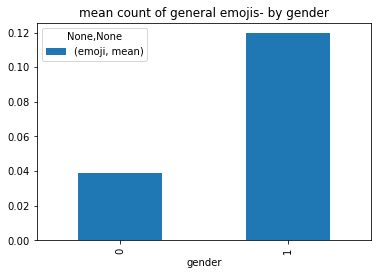
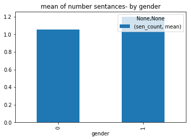
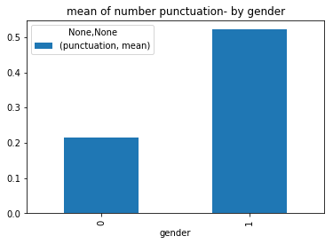
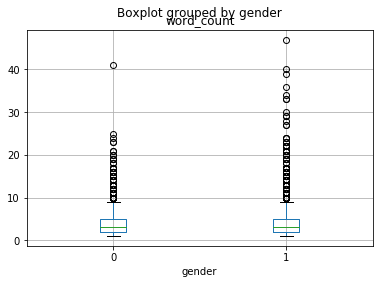
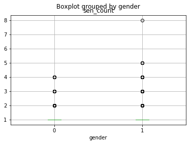
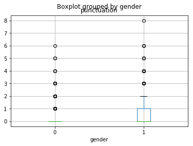
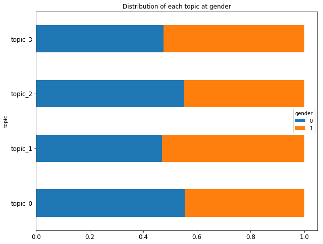
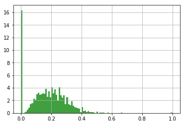

# project- part1
## Whatsapp messages
```python
%matplotlib inline
import numpy as np
import pandas as pd
import matplotlib.pyplot as plt
from datetime import date
import sklearn
import itertools
import re
import string
import csv
#data- messages from whatsapp
#the crawling data from phone files
#gender 1= female
#gender 0= male
df = pd.read_csv('C:\\Users\\DELL\\Desktop\\data_scientist\\data\\data.txt', sep="\n", header = None, error_bad_lines=False)
df['gender'] = pd.read_csv('C:\\Users\\DELL\\Desktop\\data_scientist\\data\\target.txt', sep="\n", header = None, error_bad_lines=False)
```

    b'Skipping line 2: expected 1 fields, saw 2\nSkipping line 162: expected 1 fields, saw 2\nSkipping line 186: expected 1 fields, saw 2\nSkipping line 259: expected 1 fields, saw 2\nSkipping line 306: expected 1 fields, saw 2\nSkipping line 649: expected 1 fields, saw 5\nSkipping line 682: expected 1 fields, saw 2\nSkipping line 702: expected 1 fields, saw 2\nSkipping line 747: expected 1 fields, saw 2\nSkipping line 825: expected 1 fields, saw 2\nSkipping line 856: expected 1 fields, saw 3\nSkipping line 857: expected 1 fields, saw 2\nSkipping line 867: expected 1 fields, saw 2\nSkipping line 888: expected 1 fields, saw 2\nSkipping line 898: expected 1 fields, saw 2\nSkipping line 899: expected 1 fields, saw 2\nSkipping line 1240: expected 1 fields, saw 2\nSkipping line 1278: expected 1 fields, saw 2\nSkipping line 1285: expected 1 fields, saw 3\nSkipping line 1287: expected 1 fields, saw 2\nSkipping line 1316: expected 1 fields, saw 2\nSkipping line 1361: expected 1 fields, saw 2\nSkipping line 1364: expected 1 fields, saw 2\nSkipping line 1443: expected 1 fields, saw 2\nSkipping line 1593: expected 1 fields, saw 2\nSkipping line 1625: expected 1 fields, saw 2\nSkipping line 1843: expected 1 fields, saw 2\nSkipping line 2006: expected 1 fields, saw 2\nSkipping line 2007: expected 1 fields, saw 2\nSkipping line 2021: expected 1 fields, saw 2\nSkipping line 2113: expected 1 fields, saw 2\nSkipping line 2116: expected 1 fields, saw 2\nSkipping line 2332: expected 1 fields, saw 2\nSkipping line 2346: expected 1 fields, saw 2\nSkipping line 2477: expected 1 fields, saw 2\nSkipping line 3138: expected 1 fields, saw 2\nSkipping line 3244: expected 1 fields, saw 2\nSkipping line 3642: expected 1 fields, saw 2\nSkipping line 3675: expected 1 fields, saw 2\nSkipping line 3699: expected 1 fields, saw 2\nSkipping line 3991: expected 1 fields, saw 2\nSkipping line 4002: expected 1 fields, saw 2\nSkipping line 4440: expected 1 fields, saw 2\nSkipping line 4823: expected 1 fields, saw 2\n'
    

# Preproccesing

1. drop null
2. remove invalid messages (with Invalid format)
3. extract message
4. messages cleaning
5. create and remove stop-words
6. drop duplicates records


```python
#change name to anonymous
# df[0]=df[0].apply(lambda x: x.replace('שירן', 'אנונימוס'))
```


```python
df[0]=df[0].dropna()
#remove invalid messages
df=df[df[0].str.contains("<מדיה הושמטה>") == False]
df=df[df[0].str.contains("-") == True]
df[1]=pd.DataFrame(df[0].apply(lambda x: x[x.index('-')+1:]))
df=df[df[1].str.contains(":") == True]
df['message']=pd.DataFrame(df[1].apply(lambda x: x[x.index(':')+1:]))
```


```python
# remove punctuation from data
regex = re.compile('[%s]' % re.escape(string.punctuation))
df['message_clean']= df['message'].apply(lambda x: regex.sub('', x))
```


```python
from collections import Counter
#creat stop-words - the x most frequent words 
result=df.message_clean.apply(lambda x: pd.value_counts(x.split(" "))).sum(axis = 0)
result=result.sort_values(ascending=False)
stop=result.head(30)
#remove stop-words
df['message_clean'] = df['message_clean'].apply(lambda x: ' '.join([word for word in x.split() if word not in (stop)]))
```


```python
stop
```


                4495.0
    לא           400.0
    אני          394.0
    מה           209.0
    את           204.0
    זה           185.0
    לי           176.0
    אתה          166.0
    יש           158.0
    כן           130.0
    של           124.0
    אנונימוס     122.0
    עם           112.0
    על           109.0
    איזה         103.0
    חחח          100.0
    לך            98.0
    טוב           96.0
    הוא           95.0
    עוד           86.0
    יוחאי         83.0
    גם            83.0
    חחחח          82.0
    איפה          80.0
    אז            77.0
    אבל           75.0
    תודה          72.0
    או            71.0
    כבר           71.0
    סבבה          69.0
    dtype: float64


```python
#drop duplicates records
df.drop_duplicates(subset=None, keep='first', inplace=True)
```

# Feature extraction

1. number of words in message
2. number of sentances in message
3. number of punctuation in message
4. check suffix ת after אני- eg. אני חושבת
5. general emojis
6. feminine emojis- hearts, flowers..
7. sequences like חחחח
8. relevance to topic


```python
#word count
df['word_count']=df['message'].apply(lambda x: len(x.split(' '))-1)
reg_line = re.compile('([^.\\n;?!]* *[.\\n;?!]+)[ .\\n;?!]*|[^.\\n;?!]+$')
#sentances count
df['sen_count']=df['message'].apply(lambda x: len(re.findall(reg_line,x)))
#punctuation count
reg = """[\.\!\?\"\-\,\']+"""
df['punctuation']=df['message'].apply(lambda x: len(re.findall(reg, x)))
```


```python
#drop unnecessary columns
df=df.drop(df.columns[[0,2]], axis=1)
```


```python
regex='(אני+ [א|ב|ג|ד|ה|ו|ז|ח|ט|י|כ|ל|נ|ס|ע|פ|צ|ק|ר|ש|ת]+ת)'
df['suffix']=df['message'].apply(lambda x: len(re.findall(regex,x)))

regex='(אני+ [א|ב|ג|ד|ה|ו|ז|ח|ט|י|כ|ל|נ|ס|ע|פ|צ|ק|ר|ש|ת]+ה)'
df['suffix2']=df['message'].apply(lambda x: len(re.findall(regex,x)))
```


```python
reg='😀|😃|😄|😁|😆|😅|😂|🤣|☺|😊|😇|🙂|🙃|😉|😌|😍|😘|😔|😞|😒|😏|🤠|🤡|😎|🤓|🤗|🤑|😛|😝|😜|😋|😚|😙|😗|😧|🤥|👾|😦|🤔|👽|😯|🙄|☠|😑|😴|💀|😐|😪|👻|💩|😓|😶|😡|😭|👺|👹|🤤|😠|😤|😥|👿|😈|😢|😩|😫|😰|🤕|🤒|😨|😖|😣|😱|😷|🤧|😳|☹|🙁|😵|🤢|🤐|😲|😕|😟|😮|😬|👍|👌|🖕|🍺|🍻'
reg2='👩‍|❤‍|💋‍|👩|👨‍|❤‍|💋‍|👨|💏|👨‍|❤‍|👨|👩‍|❤‍|👩|💑|💋|💄|♥|❤|💛|💚|💙|💜|💔|💕|🌷|🌹|🌻|🌼|🌸|🌺'
df['emoji']=df['message_clean'].apply(lambda x: len(re.findall(reg,x)))
df['emoji2']=df['message_clean'].apply(lambda x: len(re.findall(reg2,x)))
```


```python
reg='אאא+|בבב+|גגג+|דדד+|ההה+|ווו+|זזז+|חחח+|טטט+|ייי+|כככ+|ללל+|מממ+|נננ+|ססס+|עעע+|פפפ+|צצצ+|קקק+|ררר+|ששש+|תתת+|םםם+|ףףף+|ךךך+|ץץץ+'
df['sequence']=df['message'].apply(lambda x: len(re.findall(reg,x)))
```

## Topic Modeling


```python
from sklearn.feature_extraction.text import CountVectorizer
from sklearn.decomposition import LatentDirichletAllocation

vectorizer = CountVectorizer(min_df=10, max_df=0.1, encoding="cp1255")
# matrix [doc,term] for each entry number of occurence of term t in doc d
mat = vectorizer.fit_transform(df["message_clean"])
lda = LatentDirichletAllocation(n_topics=4)
## matrix [doc,topic] for each entry probability of topic t in doc d
topics = lda.fit_transform(mat)

df_topics_words = pd.DataFrame()
for i in range(lda.components_.shape[0]):
    k=pd.DataFrame(lda.components_, columns=vectorizer.get_feature_names()).T[i].sort_values(ascending=False).head(100)
    df_topics_words['topic '+str(i)+' words'] = k.index
    df_topics_words['topic '+str(i)+' value'] = k.values
    d=dict(zip(vectorizer.get_feature_names(),map(lambda x: int(x),lda.components_[0])))
```

    C:\Users\DELL\Anaconda3\envs\py35\lib\site-packages\sklearn\decomposition\online_lda.py:508: DeprecationWarning: The default value for 'learning_method' will be changed from 'online' to 'batch' in the release 0.20. This warning was introduced in 0.18.
      DeprecationWarning)
    


```python
#create docs-topics df
for i in range(topics.shape[1]):
    df['topic_'+str(i)]=pd.to_numeric(topics.T[i])
```


```python
df_topics_words.head(5)
```


<div>
<table border="1" class="dataframe">
  <thead>
    <tr style="text-align: right;">
      <th></th>
      <th>topic 0 words</th>
      <th>topic 0 value</th>
      <th>topic 1 words</th>
      <th>topic 1 value</th>
      <th>topic 2 words</th>
      <th>topic 2 value</th>
      <th>topic 3 words</th>
      <th>topic 3 value</th>
    </tr>
  </thead>
  <tbody>
    <tr>
      <th>0</th>
      <td>היום</td>
      <td>66.441271</td>
      <td>לו</td>
      <td>65.743333</td>
      <td>ממש</td>
      <td>70.441579</td>
      <td>אין</td>
      <td>58.248047</td>
    </tr>
    <tr>
      <th>1</th>
      <td>שלי</td>
      <td>61.302269</td>
      <td>מתי</td>
      <td>55.748701</td>
      <td>רוצה</td>
      <td>56.072445</td>
      <td>חח</td>
      <td>55.385996</td>
    </tr>
    <tr>
      <th>2</th>
      <td>אם</td>
      <td>61.162600</td>
      <td>מי</td>
      <td>53.152405</td>
      <td>מחר</td>
      <td>51.452475</td>
      <td>כל</td>
      <td>53.495159</td>
    </tr>
    <tr>
      <th>3</th>
      <td>היה</td>
      <td>59.834660</td>
      <td>צריך</td>
      <td>50.937712</td>
      <td>אתם</td>
      <td>50.896623</td>
      <td>עכשיו</td>
      <td>49.077745</td>
    </tr>
    <tr>
      <th>4</th>
      <td>רק</td>
      <td>58.687609</td>
      <td>נראה</td>
      <td>50.690457</td>
      <td>יפה</td>
      <td>32.841771</td>
      <td>חחחחח</td>
      <td>47.948929</td>
    </tr>
  </tbody>
</table>
</div>


```python
#best topic for each example
df["topic"] = df[["topic_0", "topic_1", "topic_2", "topic_3"]].idxmax(axis=1)
```


```python
df.head(2)
```


<div>
<table border="1" class="dataframe">
  <thead>
    <tr style="text-align: right;">
      <th></th>
      <th>gender</th>
      <th>message</th>
      <th>message_clean</th>
      <th>word_count</th>
      <th>sen_count</th>
      <th>punctuation</th>
      <th>suffix</th>
      <th>suffix2</th>
      <th>emoji</th>
      <th>emoji2</th>
      <th>sequence</th>
      <th>topic_0</th>
      <th>topic_1</th>
      <th>topic_2</th>
      <th>topic_3</th>
      <th>topic</th>
    </tr>
  </thead>
  <tbody>
    <tr>
      <th>2</th>
      <td>0</td>
      <td>חחחחח</td>
      <td>חחחחח</td>
      <td>1</td>
      <td>1</td>
      <td>0</td>
      <td>0</td>
      <td>0</td>
      <td>0</td>
      <td>0</td>
      <td>1</td>
      <td>0.125002</td>
      <td>0.125003</td>
      <td>0.125003</td>
      <td>0.624992</td>
      <td>topic_3</td>
    </tr>
    <tr>
      <th>3</th>
      <td>0</td>
      <td>חברים, התחלנו. בקבוצה זו נעסוק בנושאי הליבה ה...</td>
      <td>חברים התחלנו בקבוצה זו נעסוק בנושאי הליבה הטמו...</td>
      <td>13</td>
      <td>2</td>
      <td>3</td>
      <td>0</td>
      <td>0</td>
      <td>0</td>
      <td>0</td>
      <td>1</td>
      <td>0.624961</td>
      <td>0.125012</td>
      <td>0.125014</td>
      <td>0.125012</td>
      <td>topic_0</td>
    </tr>
  </tbody>
</table>
</div>


## Visualization


```python
#most freq words in female messages
df_female=df[df['gender'] == 1]
df_female_freq=df_female.message_clean.apply(lambda x: pd.value_counts(x.split(" "))).sum(axis = 0)
df_female_freq=df_female_freq.sort_values(ascending=False)
df_female_freq=df_female_freq.head(6)
df_female_freq
```


           120.0
    ממש     50.0
    שלי     46.0
    לו      37.0
    איך     36.0
    כל      35.0
    dtype: float64


```python
#most freq words in female messages
df_male=df[df['gender'] == 0]
df_male_freq=df_male.message_clean.apply(lambda x: pd.value_counts(x.split(" "))).sum(axis = 0)
df_male_freq=df_male_freq.sort_values(ascending=False)
df_male_freq=df_male_freq.head(6)
df_male_freq
```


            174.0
    מי       44.0
    רוצה     40.0
    חח       39.0
    רק       36.0
    אתם      36.0
    dtype: float64


```python
#number of messages for each gender
df.gender.groupby(df.gender).agg(['count'])
```


<div>
<table border="1" class="dataframe">
  <thead>
    <tr style="text-align: right;">
      <th></th>
      <th>count</th>
    </tr>
    <tr>
      <th>gender</th>
      <th></th>
    </tr>
  </thead>
  <tbody>
    <tr>
      <th>0</th>
      <td>2280</td>
    </tr>
    <tr>
      <th>1</th>
      <td>2008</td>
    </tr>
  </tbody>
</table>
</div>


```python
plot6=df[['sequence']].groupby(df.gender).agg(['mean'])
plot6.plot(kind='bar', stacked=True, grid=False, title='mean count of sequences by gender')
```


    <matplotlib.axes._subplots.AxesSubplot at 0x15406849860>





```python
plot5=df[['emoji2']].groupby(df.gender).agg(['mean'])
plot5.plot(kind='bar', stacked=True, grid=False, title='mean count of feminine emojis- by gender')
```


    <matplotlib.axes._subplots.AxesSubplot at 0x1545b222cc0>


```python
plot0=df[['emoji']].groupby(df.gender).agg(['mean'])
plot0.plot(kind='bar', stacked=True, grid=False, title='mean count of general emojis- by gender')
```


    <matplotlib.axes._subplots.AxesSubplot at 0x15404d3a780>





```python
plot2=df[['word_count']].groupby(df.gender).agg(['mean'])
plot2.plot(kind='bar', stacked=True, grid=False, title='mean of number words- by gender')

df.boxplot(column='word_count', by = 'gender')
```


    <matplotlib.axes._subplots.AxesSubplot at 0x15404fcc0f0>








```python
plot3=df[['sen_count']].groupby(df.gender).agg(['mean'])
plot3.plot(kind='bar', stacked=True, grid=False, title='mean of number sentances- by gender')

df.boxplot(column='sen_count', by = 'gender')
```


    <matplotlib.axes._subplots.AxesSubplot at 0x15401e16278>





```python
plot4=df[['punctuation']].groupby(df.gender).agg(['mean'])
plot4.plot(kind='bar', stacked=True, grid=False, title='mean of number punctuation- by gender')

df.boxplot(column='punctuation', by = 'gender')
```


    <matplotlib.axes._subplots.AxesSubplot at 0x1540405f320>





```python
df3=df.groupby(by=['topic','gender']).size().unstack(level=-1).fillna(0).apply(lambda x: x.apply(lambda y: y/x.sum()),axis=1)
ax=df3.plot.barh(stacked=True,figsize=(10,8),grid=False,fontsize=12,title='Distribution of each topic at gender')
plt.show()
```





### distances between female & male messages
distances by Sequence


```python
import Levenshtein
from difflib import SequenceMatcher

#distances between male messages and fimale messages
for i in range(0,1):
    data_f=df[df['gender']==1]
    data_m=df[df['gender']==0]
    list_f=list(data_f.message_clean.values)
    list_m=list(data_m.message_clean.values)
    list_dist=list()
    for i in list_m:
        for j in list_f:
            list_dist.append(float(SequenceMatcher(None, i, j).ratio()))
```


```python
import matplotlib.mlab as mlab

# histogram of the distances data
n, bins, patches = plt.hist(list_dist, 100, normed=3, facecolor='green', alpha=0.75)
plt.grid(True)
plt.show()
```





```python

```
