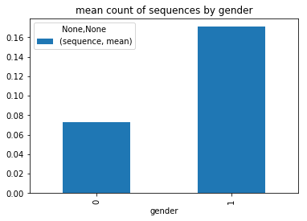

```python
%matplotlib inline
import numpy as np
import pandas as pd
import matplotlib.pyplot as plt
from datetime import date
import sklearn
import itertools
import re
import string
import csv

#the crawling data from phone files
df = pd.read_csv('C:\\Users\\DELL\\Desktop\\data_scientist\\data.txt', sep="\n", header = None, error_bad_lines=False)
df['gender'] = pd.read_csv('C:\\Users\\DELL\\Desktop\\data_scientist\\target.txt', sep="\n", header = None, error_bad_lines=False)
```

    b'Skipping line 2: expected 1 fields, saw 2\nSkipping line 162: expected 1 fields, saw 2\nSkipping line 186: expected 1 fields, saw 2\nSkipping line 259: expected 1 fields, saw 2\nSkipping line 306: expected 1 fields, saw 2\nSkipping line 649: expected 1 fields, saw 5\nSkipping line 682: expected 1 fields, saw 2\nSkipping line 702: expected 1 fields, saw 2\nSkipping line 747: expected 1 fields, saw 2\nSkipping line 825: expected 1 fields, saw 2\nSkipping line 856: expected 1 fields, saw 3\nSkipping line 857: expected 1 fields, saw 2\nSkipping line 867: expected 1 fields, saw 2\nSkipping line 888: expected 1 fields, saw 2\nSkipping line 898: expected 1 fields, saw 2\nSkipping line 899: expected 1 fields, saw 2\nSkipping line 1241: expected 1 fields, saw 2\nSkipping line 1279: expected 1 fields, saw 2\nSkipping line 1286: expected 1 fields, saw 3\nSkipping line 1288: expected 1 fields, saw 2\nSkipping line 1317: expected 1 fields, saw 2\nSkipping line 1362: expected 1 fields, saw 2\nSkipping line 1365: expected 1 fields, saw 2\nSkipping line 1444: expected 1 fields, saw 2\nSkipping line 1594: expected 1 fields, saw 2\nSkipping line 1626: expected 1 fields, saw 2\nSkipping line 1844: expected 1 fields, saw 2\nSkipping line 2007: expected 1 fields, saw 2\nSkipping line 2008: expected 1 fields, saw 2\nSkipping line 2022: expected 1 fields, saw 2\nSkipping line 2114: expected 1 fields, saw 2\nSkipping line 2117: expected 1 fields, saw 2\nSkipping line 2333: expected 1 fields, saw 2\nSkipping line 2347: expected 1 fields, saw 2\nSkipping line 2478: expected 1 fields, saw 2\nSkipping line 3139: expected 1 fields, saw 2\nSkipping line 3245: expected 1 fields, saw 2\nSkipping line 3643: expected 1 fields, saw 2\nSkipping line 3676: expected 1 fields, saw 2\nSkipping line 3700: expected 1 fields, saw 2\nSkipping line 3992: expected 1 fields, saw 2\nSkipping line 4003: expected 1 fields, saw 2\nSkipping line 4441: expected 1 fields, saw 2\nSkipping line 4824: expected 1 fields, saw 2\n'
    

# Preproccesing

1. drop null
2. remove invalid messages (with Invalid format)
3. extract message
4. messages cleaning
5. create and remove stop-words


```python
#change name to anonymous
# df[0]=df[0].apply(lambda x: x.replace('שירן', 'אנונימוס'))
```


```python
df[0]=df[0].dropna()
#remove invalid messages
df=df[df[0].str.contains("<מדיה הושמטה>") == False]
df=df[df[0].str.contains("-") == True]
df[1]=pd.DataFrame(df[0].apply(lambda x: x[x.index('-')+1:]))
df=df[df[1].str.contains(":") == True]
df['message']=pd.DataFrame(df[1].apply(lambda x: x[x.index(':')+1:]))
```


```python
# remove punctuation from data
regex = re.compile('[%s]' % re.escape(string.punctuation))
df['message_clean']= df['message'].apply(lambda x: regex.sub('', x))
```


```python
from collections import Counter
#creat stop-words - the x most frequent words 
result=df.message_clean.apply(lambda x: pd.value_counts(x.split(" "))).sum(axis = 0)
result=result.sort_values(ascending=False)
stop=result.head(30)
#remove stop-words
df['message_clean'] = df['message_clean'].apply(lambda x: ' '.join([word for word in x.split() if word not in (stop)]))
```

# Feature extraction

1. number of words in message
2. number of sentances in message
3. number of punctuation in message
4. check suffix ת after אני- eg. אני חושבת
5. general emojis
6. feminine emojis- hearts, flowers..
7. sequences like חחחח 
8. relevance to topic


```python
#word count
df['word_count']=df['message'].apply(lambda x: len(x.split(' '))-1)
reg_line = re.compile('([^.\\n;?!]* *[.\\n;?!]+)[ .\\n;?!]*|[^.\\n;?!]+$')
#sentances count
df['sen_count']=df['message'].apply(lambda x: len(re.findall(reg_line,x)))
#punctuation count
reg = """[\.\!\?\"\-\,\']+"""
df['punctuation']=df['message'].apply(lambda x: len(re.findall(reg, x)))
```


```python
#drop unnecessary columns
df=df.drop(df.columns[[0,2]], axis=1)
#drop duplicates records
df.drop_duplicates(subset=None, keep='first', inplace=True)
```


```python
regex='(אני+ [א|ב|ג|ד|ה|ו|ז|ח|ט|י|כ|ל|נ|ס|ע|פ|צ|ק|ר|ש|ת]+ת)'
df['suffix']=df['message_clean'].apply(lambda x: len(re.findall(regex,x)))
```


```python
reg='😀|😃|😄|😁|😆|😅|😂|🤣|☺|😊|😇|🙂|🙃|😉|😌|😍|😘|😔|😞|😒|😏|🤠|🤡|😎|🤓|🤗|🤑|😛|😝|😜|😋|😚|😙|😗|😧|🤥|👾|😦|🤔|👽|😯|🙄|☠|😑|😴|💀|😐|😪|👻|💩|😓|😶|😡|😭|👺|👹|🤤|😠|😤|😥|👿|😈|😢|😩|😫|😰|🤕|🤒|😨|😖|😣|😱|😷|🤧|😳|☹|🙁|😵|🤢|🤐|😲|😕|😟|😮|😬|👍|👌|🖕|🍺|🍻'
reg2='👩‍|❤‍|💋‍|👩|👨‍|❤‍|💋‍|👨|💏|👨‍|❤‍|👨|👩‍|❤‍|👩|💑|💋|💄|♥|❤|💛|💚|💙|💜|💔|💕|🌷|🌹|🌻|🌼|🌸|🌺'
df['emoji']=df['message_clean'].apply(lambda x: len(re.findall(reg,x)))
df['emoji2']=df['message_clean'].apply(lambda x: len(re.findall(reg2,x)))
```


```python
reg='אאא+|בבב+|גגג+|דדד+|ההה+|ווו+|זזז+|חחח+|טטט+|ייי+|כככ+|ללל+|מממ+|נננ+|ססס+|עעע+|פפפ+|צצצ+|קקק+|ררר+|ששש+|תתת+|םםם+|ףףף+|ךךך+|ץץץ+'
df['sequence']=df['message_clean'].apply(lambda x: len(re.findall(reg,x)))
```

## Topic Modeling


```python
from sklearn.feature_extraction.text import CountVectorizer
from sklearn.decomposition import LatentDirichletAllocation

vectorizer = CountVectorizer(min_df=10, max_df=0.1, encoding="cp1255")
# matrix [doc,term] for each entry number of occurence of term t in doc d
mat = vectorizer.fit_transform(df["message_clean"])
lda = LatentDirichletAllocation(n_topics=4)
## matrix [doc,topic] for each entry probability of topic t in doc d
topics = lda.fit_transform(mat)

df_topics_words = pd.DataFrame()
for i in range(lda.components_.shape[0]):
    k=pd.DataFrame(lda.components_, columns=vectorizer.get_feature_names()).T[i].sort_values(ascending=False).head(100)
    df_topics_words['topic '+str(i)+' words'] = k.index
    df_topics_words['topic '+str(i)+' value'] = k.values
    d=dict(zip(vectorizer.get_feature_names(),map(lambda x: int(x),lda.components_[0])))
```

    C:\Users\DELL\Anaconda3\envs\py35\lib\site-packages\sklearn\decomposition\online_lda.py:508: DeprecationWarning: The default value for 'learning_method' will be changed from 'online' to 'batch' in the release 0.20. This warning was introduced in 0.18.
      DeprecationWarning)
    


```python
#create docs-topics df
for i in range(topics.shape[1]):
    df['topic_'+str(i)]=pd.to_numeric(topics.T[i])
```


```python
df_topics_words.head(5)
```


<div>
<table border="1" class="dataframe">
  <thead>
    <tr style="text-align: right;">
      <th></th>
      <th>topic 0 words</th>
      <th>topic 0 value</th>
      <th>topic 1 words</th>
      <th>topic 1 value</th>
      <th>topic 2 words</th>
      <th>topic 2 value</th>
      <th>topic 3 words</th>
      <th>topic 3 value</th>
    </tr>
  </thead>
  <tbody>
    <tr>
      <th>0</th>
      <td>砖</td>
      <td>61.633007</td>
      <td></td>
      <td>74.500613</td>
      <td>כיף</td>
      <td>49.992834</td>
      <td>砖</td>
      <td>78.784762</td>
    </tr>
    <tr>
      <th>1</th>
      <td></td>
      <td>60.389747</td>
      <td></td>
      <td>57.471292</td>
      <td>עכשיו</td>
      <td>47.266574</td>
      <td></td>
      <td>67.145191</td>
    </tr>
    <tr>
      <th>2</th>
      <td>רוצה</td>
      <td>57.692066</td>
      <td>מתי</td>
      <td>56.098981</td>
      <td>בסדר</td>
      <td>44.962801</td>
      <td></td>
      <td>64.351922</td>
    </tr>
    <tr>
      <th>3</th>
      <td>专</td>
      <td>51.169538</td>
      <td></td>
      <td>53.939387</td>
      <td>驻</td>
      <td>39.604241</td>
      <td>רק</td>
      <td>61.269042</td>
    </tr>
    <tr>
      <th>4</th>
      <td></td>
      <td>50.331136</td>
      <td>专</td>
      <td>49.570791</td>
      <td>驻</td>
      <td>30.311986</td>
      <td></td>
      <td>56.702181</td>
    </tr>
  </tbody>
</table>
</div>


```python
#best topic for each example
df["topic"] = df[["topic_0", "topic_1", "topic_2", "topic_3"]].idxmax(axis=1)
```


```python
df.head(2)
```


<div>
<table border="1" class="dataframe">
  <thead>
    <tr style="text-align: right;">
      <th></th>
      <th>gender</th>
      <th>message</th>
      <th>message_clean</th>
      <th>word_count</th>
      <th>sen_count</th>
      <th>punctuation</th>
      <th>suffix</th>
      <th>emoji</th>
      <th>emoji2</th>
      <th>sequence</th>
      <th>topic_0</th>
      <th>topic_1</th>
      <th>topic_2</th>
      <th>topic_3</th>
      <th>topic</th>
    </tr>
  </thead>
  <tbody>
    <tr>
      <th>2</th>
      <td>0</td>
      <td></td>
      <td></td>
      <td>1</td>
      <td>1</td>
      <td>0</td>
      <td>0</td>
      <td>0</td>
      <td>0</td>
      <td>1</td>
      <td>0.125004</td>
      <td>0.125004</td>
      <td>0.125005</td>
      <td>0.624988</td>
      <td>topic_3</td>
    </tr>
    <tr>
      <th>3</th>
      <td>0</td>
      <td>חברים, התחלנו. בקבוצה זו נעסוק בנושאי הליבה ה...</td>
      <td>חברים התחלנו בקבוצה זו נעסוק בנושאי הליבה הטמו...</td>
      <td>13</td>
      <td>2</td>
      <td>3</td>
      <td>0</td>
      <td>0</td>
      <td>0</td>
      <td>1</td>
      <td>0.125008</td>
      <td>0.125007</td>
      <td>0.624975</td>
      <td>0.125010</td>
      <td>topic_2</td>
    </tr>
  </tbody>
</table>
</div>


## Visualization


```python
plot6=df[['sequence']].groupby(df.gender).agg(['mean'])
plot6.plot(kind='bar', stacked=True, grid=False, title='mean count of sequences by gender')
```


    <matplotlib.axes._subplots.AxesSubplot at 0x26e963bb2e8>


```python
plot5=df[['emoji2']].groupby(df.gender).agg(['mean'])
plot5.plot(kind='bar', stacked=True, grid=False, title='mean count of feminine emojis- by gender')
```


    <matplotlib.axes._subplots.AxesSubplot at 0x26eb042c240>


```python
plot0=df[['emoji']].groupby(df.gender).agg(['mean'])
plot0.plot(kind='bar', stacked=True, grid=False, title='mean count of general emojis- by gender')
```


    <matplotlib.axes._subplots.AxesSubplot at 0x26eb13b5e80>


```python
plot2=df[['word_count']].groupby(df.gender).agg(['mean'])
plot2.plot(kind='bar', stacked=True, grid=False, title='mean of number words- by gender')

df.boxplot(column='word_count', by = 'gender')
```


    <matplotlib.axes._subplots.AxesSubplot at 0x26e9683ed30>


```python
plot3=df[['sen_count']].groupby(df.gender).agg(['mean'])
plot3.plot(kind='bar', stacked=True, grid=False, title='mean of number sentances- by gender')

df.boxplot(column='sen_count', by = 'gender')
```


    <matplotlib.axes._subplots.AxesSubplot at 0x26eba7d7c18>


```python
plot4=df[['punctuation']].groupby(df.gender).agg(['mean'])
plot4.plot(kind='bar', stacked=True, grid=False, title='mean of number punctuation- by gender')

df.boxplot(column='punctuation', by = 'gender')
```


    <matplotlib.axes._subplots.AxesSubplot at 0x26ec0669e48>





```python
df3=df.groupby(by=['topic','gender']).size().unstack(level=-1).fillna(0).apply(lambda x: x.apply(lambda y: y/x.sum()),axis=1)
ax=df3.plot.barh(stacked=True,figsize=(10,8),grid=False,fontsize=12,title='Distribution of each topic at gender')
plt.show()
```


### distances between female & male messages
distances by Sequence


```python
import Levenshtein
from difflib import SequenceMatcher

#distances between male messages and fimale messages
for i in range(0,1):
    data_f=df[df['gender']==1]
    data_m=df[df['gender']==0]
    list_f=list(data_f.message_clean.values)
    list_m=list(data_m.message_clean.values)
    list_dist=list()
    for i in list_m:
        for j in list_f:
            list_dist.append(float(SequenceMatcher(None, i, j).ratio()))
```


```python
import matplotlib.mlab as mlab

# histogram of the distances data
n, bins, patches = plt.hist(list_dist, 100, normed=3, facecolor='green', alpha=0.75)
plt.grid(True)
plt.show()
```


```python

```
